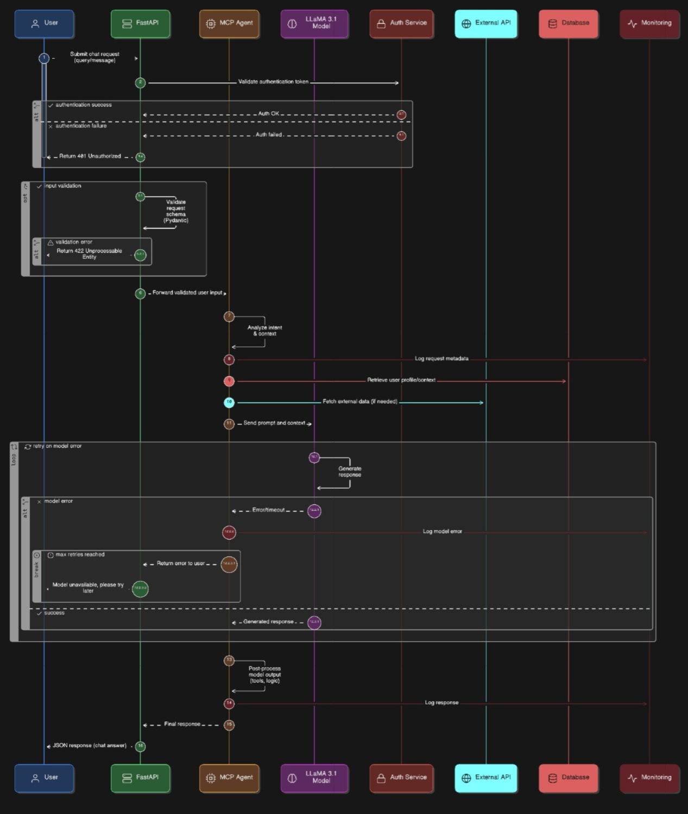
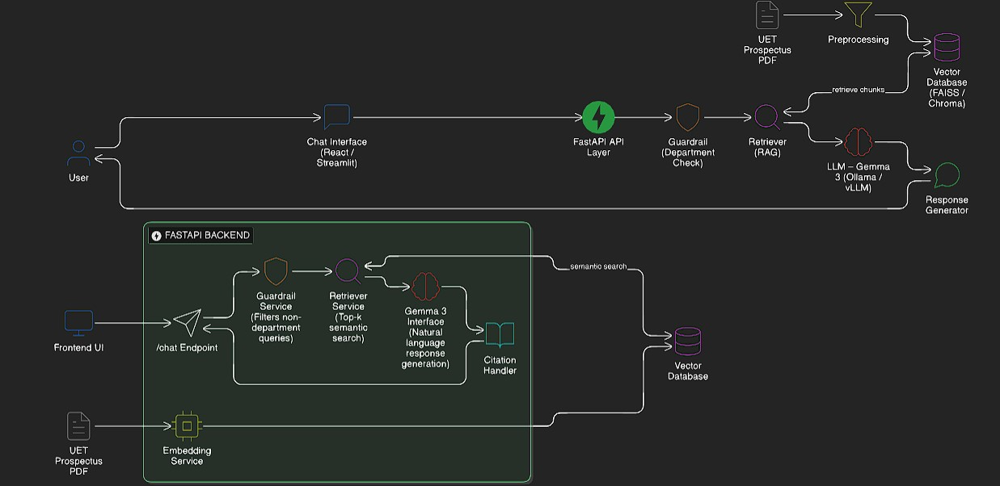

# MCP University Chatbot

A full-stack web application combining a **React frontend** with a **Python FastAPI backend** powered by MCP-Agent for intelligent document retrieval and answering.

## Project Structure

```
mcp/
├── backend/          # Python FastAPI server (port 8000)
│   ├── main.py       # MCP-Agent application & LLaMA 3 LLM integration
│   ├── server.py     # FastAPI app with /ask endpoint
│   ├── data/         # PDF files for document retrieval
│   ├── logs/         # Application logs
│   ├── pyproject.toml # Python dependencies
│   └── mcp_agent.secrets.yaml # API keys (create this)
│
└── frontend/         # React + Vite frontend (port 3000)
    ├── src/
    │   ├── pages/    # Home, Chat, About pages
    │   ├── components/ # Reusable React components
    │   └── services/ # API client
    ├── package.json  # Node.js dependencies
    └── vite.config.js # Vite build config
```

---

## Prerequisites

- **Python** 3.12+ ([download](https://www.python.org/downloads/))
- **Node.js** 18+ and npm/yarn ([download](https://nodejs.org/))
- API keys for LLM providers (Groq, OpenAI, or Anthropic)

---



## Backend Setup

### 1. Navigate to Backend Directory

```bash
cd backend
```

### 2. Create Virtual Environment

```bash
# Windows (PowerShell)
python -m venv .venv
.venv\Scripts\Activate.ps1

# Windows (CMD)
python -m venv .venv
.venv\Scripts\activate

# macOS/Linux
python -m venv .venv
source .venv/bin/activate
```

### 3. Upgrade pip and Install Dependencies

```bash
python -m pip install --upgrade pip
python -m pip install -e .
```

**If the above fails**, install packages manually:

```bash
python -m pip install "mcp-agent[llama3,openai]" groq uvicorn[standard] PyPDF2
```

### 4. Set Up API Keys

Create or edit `mcp_agent.secrets.yaml` in the `backend/` folder:

```yaml
# Using Groq (LLaMA 3)
groq:
  api_key: "your-groq-api-key-here"

# OR using OpenAI
openai:
  api_key: "your-openai-api-key-here"

# OR using Anthropic
anthropic:
  api_key: "your-anthropic-api-key-here"
```

Alternatively, set environment variables:

```bash
# Windows (PowerShell)
$env:GROQ_API_KEY="your-groq-api-key"

# Windows (CMD)
set GROQ_API_KEY=your-groq-api-key

# macOS/Linux
export GROQ_API_KEY="your-groq-api-key"
```

### 5. Add PDF Documents

Place your PDF documents in the `backend/data/` folder. Update the `pdf_path` in `main.py` if needed:

```python
pdf_path = "data/uetProspectus.pdf"  # or your filename
```

### 6. Run the Backend Server

```bash
python -m uvicorn server:app_api --reload --host 127.0.0.1 --port 8000
```

**Expected output:**
```
INFO:     Will watch for changes in these directories: ['C:\mcp\backend']
INFO:     Uvicorn running on http://127.0.0.1:8000 (Press CTRL+C to quit)
```

### 7. Verify Backend

- **FastAPI Docs:** http://127.0.0.1:8000/docs
- **Test Endpoint:**
  ```bash
  curl -X POST http://127.0.0.1:8000/ask \
    -H "Content-Type: application/json" \
    -d '{"question":"What programs does the university offer?"}'
  ```

---

## Frontend Setup

### 1. Navigate to Frontend Directory (in a new terminal)

```bash
cd frontend
```

### 2. Install Node Dependencies

```bash
npm install
# or
yarn install
```

### 3. Configure API Endpoint (if needed)

Edit `frontend/src/services/api.js` and ensure the backend URL is correct:

```javascript
const API_BASE = "http://127.0.0.1:8000";
```

### 4. Run Development Server

```bash
npm run dev
# or
yarn dev
```

**Expected output:**
```
  VITE v5.x.x  ready in xxx ms

  ➜  Local:   http://localhost:3000/
```

### 5. Open in Browser

Navigate to **http://localhost:3000/** and start using the chatbot!

---

## Running Both Frontend & Backend Together

### Terminal 1: Start Backend

```bash
cd backend
.venv\Scripts\activate          # Windows
# OR
source .venv/bin/activate       # macOS/Linux

python -m uvicorn server:app_api --reload --host 127.0.0.1 --port 8000
```

### Terminal 2: Start Frontend

```bash
cd frontend
npm run dev
```

### Expected Behavior

1. Backend running on http://127.0.0.1:8000
2. Frontend running on http://localhost:3000
3. Frontend communicates with backend via `/ask` endpoint
4. User types questions → Frontend sends to backend → LLaMA 3 processes PDF → Response displayed

---

## API Endpoints

### POST /ask

**Request:**
```json
{
  "question": "What academic programs does the university offer?"
}
```

**Response:**
```json
{
  "answer": "The university offers the following programs: ..."
}
```

---

## File Descriptions

### Backend

| File | Purpose |
|------|---------|
| `main.py` | MCP-Agent setup, PDF extraction, LLaMA 3 integration |
| `server.py` | FastAPI application with `/ask` endpoint and CORS |
| `pyproject.toml` | Python dependencies (mcp-agent, groq, uvicorn, etc.) |
| `mcp_agent.config.yaml` | MCP-Agent configuration (agents, servers) |
| `mcp_agent.secrets.yaml` | API keys (create this, don't commit!) |

### Frontend

| File | Purpose |
|------|---------|
| `src/pages/Chat.jsx` | Main chat interface |
| `src/pages/Home.jsx` | Landing page |
| `src/pages/About.jsx` | About page |
| `src/services/api.js` | API client for backend communication |
| `src/components/ChatWindow.jsx` | Chat message display |
| `src/components/MessageBubble.jsx` | Individual message styling |
| `package.json` | Node.js dependencies (React, Vite, Tailwind, etc.) |
| `vite.config.js` | Vite bundler configuration |

---

## Troubleshooting

### Backend Issues

**"ModuleNotFoundError: No module named 'mcp_agent'"**
- Ensure virtual environment is activated
- Run `python -m pip install -e .` or install manually

**"No such file or directory: data/uetProspectus.pdf"**
- Add PDF files to `backend/data/` folder
- Update `pdf_path` variable in `main.py`

**CORS Error from Frontend**
- Verify backend CORS settings in `server.py` match frontend origin
- Default: `allow_origins=["http://localhost:3000"]`

**API Key Not Found**
- Create `mcp_agent.secrets.yaml` with your API keys
- OR set environment variables (`GROQ_API_KEY`, `OPENAI_API_KEY`, etc.)

### Frontend Issues

**"Cannot find module '@/services/api'"**
- Check path aliases in `vite.config.js`
- Ensure `frontend/src/services/api.js` exists

**"Failed to fetch from http://127.0.0.1:8000"**
- Verify backend is running on port 8000
- Check firewall/network settings
- Ensure CORS is enabled in `server.py`

---

## Development Workflow

1. **Make backend changes** → Auto-reload enabled with `--reload` flag
2. **Make frontend changes** → Vite hot-reload on save
3. **Restart services** if dependencies are changed

---

## Building for Production

### Backend

```bash
# Create optimized production dependencies
pip freeze > requirements.txt

# Or use uv for faster installs
uv sync --frozen
```

### Frontend

```bash
npm run build
# Output: dist/ folder (ready to deploy)

# Preview production build
npm run preview
```

---

## Deployment

### Backend (Cloud Options)
- **MCP-Agent Cloud:** `uv run mcp-agent deploy hello_world`
- **Vercel/Railway:** Deploy FastAPI app
- **AWS/GCP/Azure:** Docker container with Uvicorn

### Frontend (Cloud Options)
- **Vercel:** `vercel deploy`
- **Netlify:** Drag & drop `dist/` folder
- **GitHub Pages:** Configure in vite.config.js

---

## Key Technologies

| Component | Tech Stack |
|-----------|-----------|
| Backend | Python 3.12+, FastAPI, MCP-Agent, Groq/OpenAI LLM |
| Frontend | React 18+, Vite, Tailwind CSS |
| PDF Processing | PyPDF2 |
| API Communication | Fetch API, CORS |

---

## Support & Resources

- **MCP-Agent Docs:** https://docs.mcp-agent.com/
- **FastAPI Docs:** https://fastapi.tiangolo.com/
- **React Docs:** https://react.dev/
- **Groq API:** https://console.groq.com/
- **OpenAI API:** https://platform.openai.com/

---

## License

[Your License Here]

---

**Last Updated:** February 1, 2026
